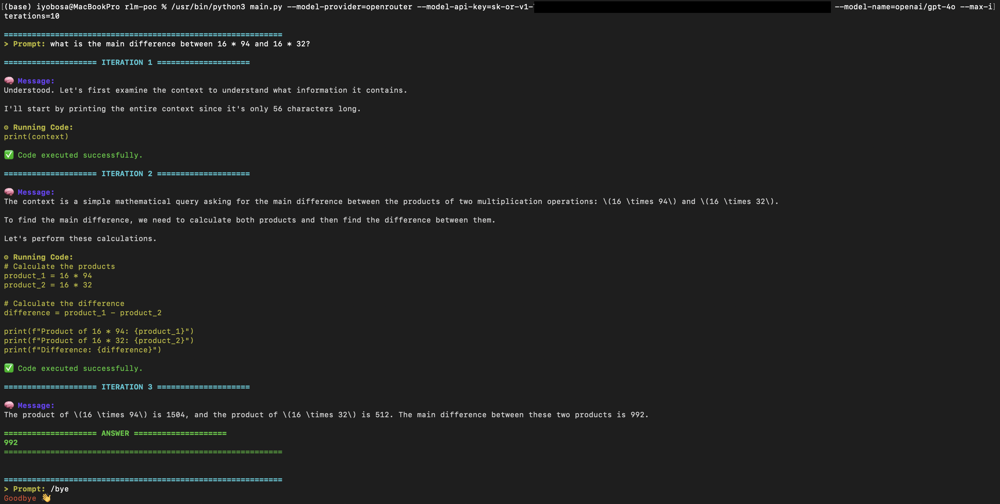

# Recursive Language Models

## About

This repo contains my own simple implementation of **Recursive Language Models**, based on the paper [Recursive Language Models](https://arxiv.org/abs/2512.24601). This repository only contains work on **RLM with REPL (no sub-calls)**.



## Tools

### Python Packages

- colorama
- requests
- tenacity

### LLM(s)

- OpenRouter API

## Setup

Clone the repo and run with your OpenRouter API key. Run with.

```bash
python3 main.py --model-provider=[MODEL-PROVIDER] --model-api-key=[MODEL-API-KEY] --model-name=[MODEL-NAME] --max-iterations=[MAX-ITERATIONS]
```

### Arguments

- `--model-provider`: The model provider, it only supports `openrouter` for now.
- `--model-api-key`: The model provider's API key.
- `--model-name`: The name of the exact model from the API provider.
- `--max-iterations`: The maximum number of recursive iterations for the RLM.

### OpenRouter Example

```bash
python3 main.py --model-provider=openrouter --model-api-key=sk-or-v1-... --model-name=openai/gpt-4o --max-iterations=10
```

## Future Work and Ongoing Work

- RLM with REPL [and sub-calls]
- Evaluating this RLM against a non-RLM system

## BibTeX

```bibtex
@article{zhang2025recursive,
  title={Recursive Language Models},
  author={Zhang, Alex L. and Kraska, Tim and Khattab, Omar},
  journal={arXiv preprint arXiv:2512.24601},
  year={2025},
  doi={10.48550/arXiv.2512.24601}
}